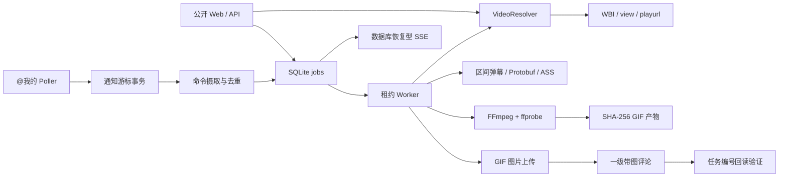

# 架构

服务按边界分为输入/命令、B站适配、领域任务、SQLite store、媒体、worker、HTTP/Web 和运维层。具体 HTTP、数据库和 FFmpeg 实现通过构造函数注入，业务层不依赖 Web 框架。



## 持久化与恢复

`jobs` 是队列真源。worker 以事务认领任务并写入 `lease_owner/lease_until`；每次认领前都会检查超时租约，而不是只在启动时恢复，因此“重启早于旧租约过期”也不会永久卡住。租约续期失败会立即取消本地媒体工作，避免两个 worker 同时处理。状态、进度、通知、游标、尝试、产物和发布记录均先落 SQLite。SSE 每次从数据库读取并发送心跳，因此重连或服务重启不丢状态。

首次通知轮询默认只保存最新事件游标，不插入历史事件。后续轮询从最新页开始向旧页翻页，遇到保存的通知 ID/时间停止，新事件反转为时间正序后在同一事务保存事件与游标。事件摄取与 job 入队分开：崩溃时 `received` 事件仍会被再次摄取；唯一索引避免重复任务。

## 发布幂等

评论文字包含独立一行 `任务：CA<ULID>`。worker 在任何上传/发布重试前按 B站返回的真实 cursor 扫描同视频评论，并同时校验作者 MID 与精确任务行；找到后补写 `published_comments`，不再发送。新结果只调用一级评论 payload；原评论提示走独立纯文字回复与限流。账号侧回读只能证明账号看得到，状态仍是 `published_unverified`。

## 并发

worker、FFmpeg、发布分别有限并发。FFmpeg Runner 使用独立信号量；发布使用单槽信号量。相同渲染键通过进程内 flight 合并，并可复用 SQLite 中尚未过期的产物；Web 活跃任务还由部分唯一索引原子去重，两个不同评论的交付任务则保持独立。机器人暂停时 mention job 不会被认领，处理中遇到风控/凭据失效会停放而非消耗重试预算。所有后台 goroutine 都纳入停机等待；SIGTERM 先停止认领，等待进行中任务，超时才取消整个 FFmpeg 进程组。

`settings` 保存一份版本化、非敏感的运行参数文档。管理端使用与启动相同的交叉字段校验；下一次启动会在构造 worker/HTTP/清理器前应用。路径、可执行文件和凭据不允许从管理页面改写。

## 目录

```text
cmd/cyber-amber        进程入口与装配
internal/bili          端点、HTTP、WBI、视频、通知、弹幕、账号、上传、评论
internal/command       评论命令解析
internal/domain        任务、状态机和产物模型
internal/store         SQLite repository 与租约
internal/media         ASS、FFmpeg、ffprobe、字体和 GIF 策略
internal/worker        统一媒体/发布管线
internal/httpserver    API、安全、SSE、embed Web
migrations             嵌入二进制的 SQL migration
proto                  弹幕协议源
deploy                 systemd 与 nginx
```
